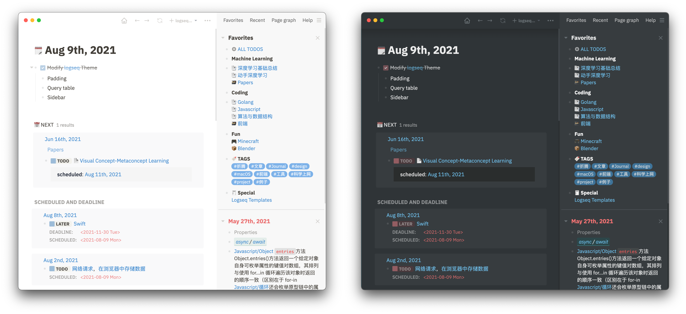

<h1 align="center">
  <br>logseq-bonofix-theme<br>
</h1>

<p align="center">
  <a href="#screenshots">🌠 Screenshots</a>
   | 
  <a href="#install">📦 Install</a>
   | 
  <a href="#whats-improved">✨ What's improved</a>
   | 
  <a href="#how-to-build">🔨 How to build</a>
</p>


This is a theme for [Logseq](https://github.com/logseq/logseq), focusing on **UI bug fixes and typography** with massive mobile experience improvements.

## Screenshots

The style is strongly inspired by [logseq-bujo-theme](https://github.com/PiotrSss/logseq-bujo-theme ) and [Notion](https://notion.so). The code is mainly based on bujo theme, and you may find the style really notion-like.




## Install

Check your Version

### If you are using Chrome(chromium) or desktop version:

- General installation

  Copy the whole content of [custom.css](https://raw.githubusercontent.com/Sansui233/logseq-bonofix-theme/master/custom.css) into your logseq/custom.css file.

- If you are always working online

  Copy this one-line-installation into your logseq/custom.css file

  ```css
  @import url('https://cdn.jsdelivr.net/gh/sansui233/logseq-bonofix-theme/custom.css')
  ```

### If you are using Safari(webkit):

Copy this one-line-installation into your logseq/custom.css file

```css
@import url('https://cdn.jsdelivr.net/gh/sansui233/logseq-bonofix-theme/custom-safari.css')
```

### If you use Chrome(chromium) on desktop and Safari(webkit) on mobile

Recommend to use `custom-safari.css`. Then install Chrome extension [Stylus](https://chrome.google.com/webstore/detail/stylus/clngdbkpkpeebahjckkjfobafhncgmne), and add this line to logseq.com:

```css
.CodeMirror-line {
    width: 0;
}
```

### (Dev Mode) Install Via Logseq Plugin


- Download the source code and unpack it into a directory

- Open Logseq→Settings, enable developer mode

- Open Logseq→Plugins, load unpacked plugin

- Open Logseq→Themes, choose your theme

  > DON'T MOVE THE PLUGININ DIRECTORY ON YOUR DISK

## What's improved

**Bug fix**

- Fix code block overflow bug, see 👉 [details](https://github.com/Sansui233/logseq-bonofix-theme/blob/master/docs/fix-codemirror.md)

- Fix query table overflow bug, see 👉 [details](https://github.com/Sansui233/logseq-bonofix-theme/blob/master/docs/table-overflow.md)

**Improvements**

- Code block style for both dark theme and white theme

- **Better typography for headings and blocks**, see 👉 [design details](https://github.com/Sansui233/logseq-bonofix-theme/blob/master/docs/better-typography.md)

- Make tippy window like responsive card instead of filling the screen and obscuring text

- Mobile: full width search lists

- Mobile: fixed top bar

- Mobile: larger sync dot to be pressed

- Mobile: More stable scrolling experience

**Additional Styles**

- Add calender emoji before journal title  
  

- Style tags as labels  
  

**Experimental Features**

These features are included in the [custom-exp.css](./custom-exp.css).

- Fixed-width left bar  
  Move the right sidebar to the left side. To enable the single feature, append the content in [experimental/left-bar.css](./experimental/left-bar.css) to your custom.css.

## How to build

1. Install [node](https://nodejs.org/)
2. Clone repo  
  ```shell
  git clone https://github.com/Sansui233/logseq-bonofix-theme.git && cd logseq-bonofix-theme
  ```
3. Install sass  
  ```shell
npm install
  ```
4. Run build  

  ```shell
  npm run build
  ```


## Thanks

- [Logseq](https://github.com/logseq/logseq)
- [logseq-bujo-theme](https://github.com/PiotrSss/logseq-bujo-theme) by PiotrSss
- Dark mode of [Notion](https://notion.so)
- All feedbacks from email and discord
